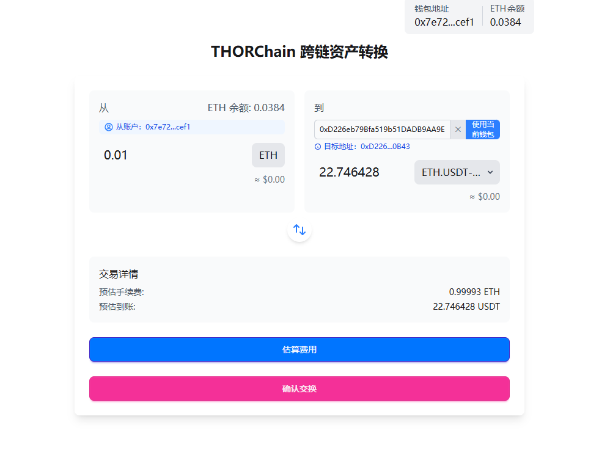
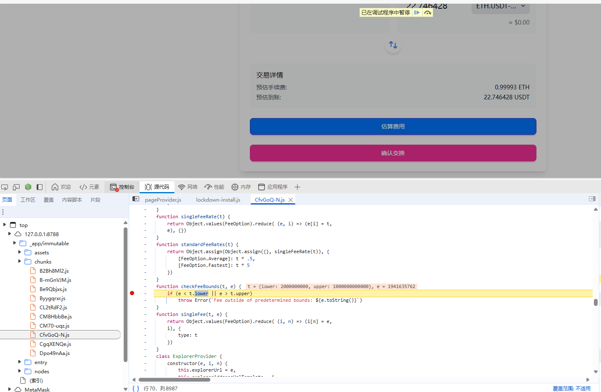
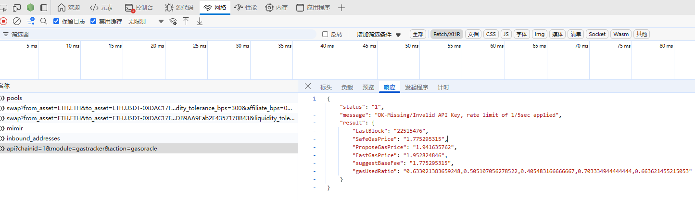

# xchain-swap

simulate THORChain swap using xchainlib-js

## build

```shell
bun run dev

# or
bun run build
wrangler pages dev .\.svelte-kit\cloudflare
```

## screenshots



## 存在的问题

### vite 无法正确导入 `safe-buffer`

https://github.com/feross/safe-buffer/issues/30

原因是 `safe-buffer` 不支持 ESM 导入，导致通过 vite 打包依赖的时候，没法正确导入 `safe-buffer`

临时手动修改打包后的文件，将

### Gas 费用计算



从 [etherscan api](
https://api.etherscan.io/v2/api?chainid=1&module=gastracker&action=gasoracle) 取到的 gas price



怀疑是 xchainjs-lib 里面定义的 gasPrice 范围太小了
https://github.com/xchainjs/xchainjs-lib/blob/master/packages/xchain-ethereum/src/const.ts#L10

